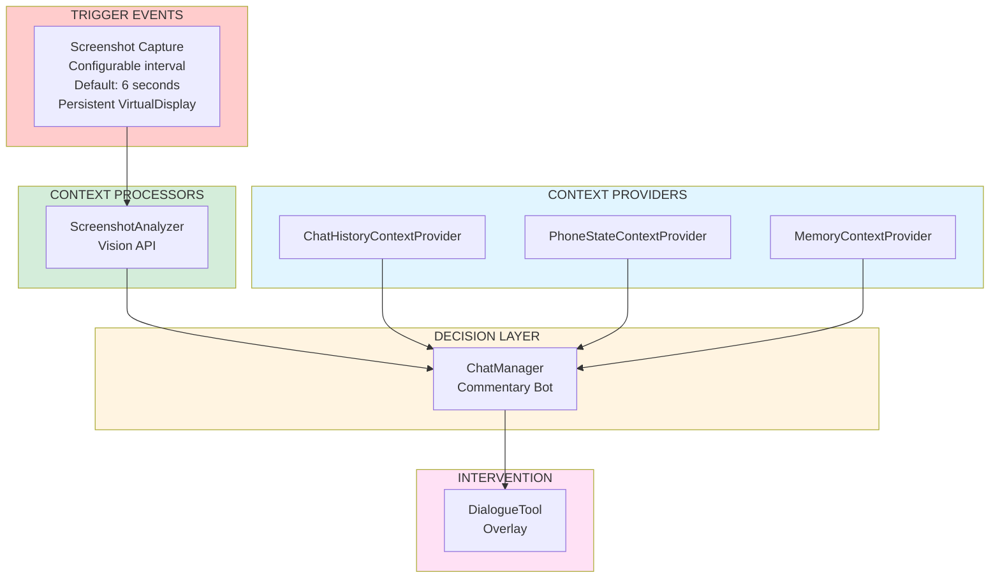
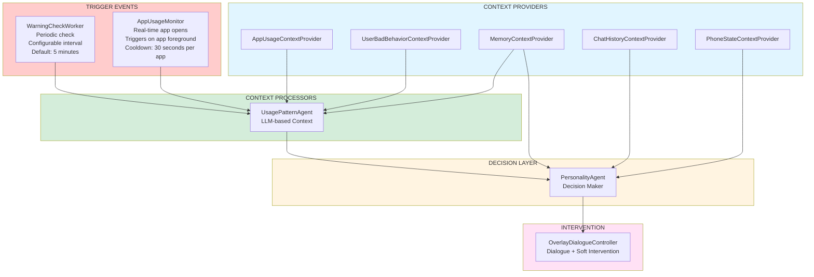

# Ralsei AI Screentime Coach

An Android AI companion that monitors device activity through automated screenshots and provides contextual interventions through character-driven dialogue. Built with a modular architecture inspired by the Model-Context-Protocol (MCP) pattern: context providers feed data to decision-making agents, which invoke intervention tools.

## Project Status

**Phase 1 (Commentary Bot)**: ✅ Complete and functional  
**Phase 2 (Warning System)**: 🚧 In active development  

## Features

### Core Functionality
- **Automated Screenshot Monitoring**: Persistent MediaProjection virtual display captures screenshots at configurable intervals
- **AI-Powered Vision Analysis**: Batch processes screenshots (3-frame batches) via OpenAI Vision API with structured output
- **Multi-Tier Memory System**: Four-layer memory architecture (SceneTimeline, CondensedMemories, RecentIntents, DialogueSummaries)
- **Interactive Chat**: Direct chat interface with Ralsei using conversational AI with full memory context
- **System Overlay Dialogue**: Character dialogue bubbles with emotion-based portraits over other apps
- **Floating Control Widget**: Draggable floating overlay with quick access to screenshot toggle, warning system toggle, and app launcher
- **Real-Time App Monitoring**: AppUsageMonitor detects app foreground events and triggers warning checks with configurable cooldown
- **Decision Scoring System**: Intelligent response generation based on activity weight, emotional resonance, and anti-repetition penalties
- **Pattern Detection**: Rule-based detection of extended app usage sessions (30+ minutes)
- **Character-Driven Responses**: LLM-generated interventions using CharacterProfiles personality system

### Configuration Options
- Screenshot intervals, image quality, batch processing
- Response thresholds (range: -1.0 to 2.0)
- Custom AI prompts for analyzer and chat
- Mock mode for offline testing with deterministic responses
- Floating overlay visibility and position persistence
- Warning system settings: periodic check interval, app open check cooldown, urgency threshold
- App ignore list: exclude specific apps from triggering warning checks

## Architecture

### MVP Refactored Design

The app follows a **strict context provider → processor → agent → tools** architecture with **two independent pipelines**.

#### Phase 1: Commentary Bot Pipeline (Real-time)



#### Phase 2: Warning System Pipeline (Periodic 5min + Real-time App Opens)



#### Layer 1: Context Providers (Data Sources)

Single-responsibility components that gather and expose raw data:

| Provider | Responsibility | Feeds Into | Returns |
|----------|---|---|---|
| **`AppUsageContextProvider`** | General app usage timeline (broader 1-2 hour view) | UsagePatternAgent | List of app usage entries (app, duration, timestamp) |
| **`ChatHistoryContextProvider`** | Intelligent extraction of conversation history | ChatManager, PersonalityAgent | Two formats: full history (20 most recent user/assistant messages + 3 recent analyzer summaries) and condensed format (user-assistant pairs with thinking/text fields extracted from structured responses). Includes PersonalityAgent outputs (warnings and commentary) for context awareness. |
| **`UserBadBehaviorContextProvider`** | User-defined problematic behaviors | UsagePatternAgent | List of bad behaviors (descriptions, app associations, severity) |
| **`PhoneStateContextProvider`** | Device state (battery, network, time) | ChatManager, PersonalityAgent | Battery level, network status, time of day, device state |
| **`MemoryContextProvider`** | Memories & SceneTimeline access | ChatManager, PersonalityAgent | CondensedMemories, RecentIntents, DialogueSummaries, SceneTimeline with natural language timestamps (e.g., "At 10:30 AM, user is watching YouTube") |

#### Layer 2: Context Processors (Data Analysis)

Transform raw data into structured context:

- **`ScreenshotAnalyzer`** (unchanged)
  - Input: Screenshots only
  - Output: `SceneTimelineEntry` (scene, activity, confidence, summary)
  - Stores: Adds to EnhancedMemoryManager.SceneTimeline
  - **New: Provides "Recent App Timeline"** → Recent 5-10 entries from SceneTimeline with detailed context (higher fidelity than AppUsageContextProvider)

- **`UsagePatternAgent`** (NEW - renamed from UsagePatternDetector, now a context processor)
  - Input: 4 context sources:
    1. **Recent App Timeline** (from ScreenshotAnalyzer sceneTimeline) - detailed, high-fidelity last 5-10 entries
    2. **AppUsageTimeline** (from AppUsageContextProvider) - broader timeline, last 1-2 hours
    3. **UserBadBehaviors** (from UserBadBehaviorContextProvider) - user-defined problematic patterns
    4. **SceneTimeline** (from MemoryContextProvider) - full historical timeline for pattern matching
  - **Purpose**: Purely objective parsing of raw context into natural language scenario
  - **Output**: `UsagePatternAnalysis` (natural language description of current usage pattern and concern indicators)
  - **NOT a decision-maker**: No urgency calculation, no determining whether to intervene
  - **Role**: Like ScreenshotAnalyzer, it only describes what's happening, not what should be done
  - Example output:
    ```
    "Kris has been on YouTube for 47 minutes (since 2:30pm). 
    Recent activity: rapid scrolling through Shorts, 4 app switches total.
    User previously noted: 'YouTube Shorts makes me lose sleep.'
    Similar pattern: 45min YouTube session last Tuesday at 2pm."
    ```

#### Layer 3: Agents (Decision Layer)

LLM-based agents that use processed context to make decisions:

##### **ChatManager (Commentary Bot Pipeline)**
- **Isolated Pipeline**: Screenshot → ScreenshotAnalyzer → ChatManager → DialogueTool
- **Input**: Developer payload from ScreenshotAnalyzer
- **Decision**: DecisionScore formula (unchanged)
- **Output**: Dialogue response to DialogueTool
- **NO connection to other agents**

##### **PersonalityAgent (NEW - now receives context from UsagePatternAgent)**
- **Purpose**: Make decisions and generate character responses based on context provided by processors
- **Input sources**:
  1. From **ScreenshotAnalyzer**: Developer payload (for Commentary Bot pipeline)
  2. From **UsagePatternAgent**: Natural language scenario describing usage patterns and concerns
  3. From **ChatHistoryContextProvider**: Condensed chat history with thinking fields (user-assistant conversation pairs)
  4. From **MemoryContextProvider**: Formatted memory context with natural language timestamps
- **Prompt Structure**: Uses ChatManager-style prompt with [STYLE], [TRAITS], [REQUEST FORMAT], [MULTI-TASK PROCESSING], and [EMOTION RULE] sections
- **Decision Logic**: 
  - For Phase 1 (Commentary): Uses ScreenshotAnalyzer context + DecisionScore to decide on response
  - For Phase 2 (Warning): Uses UsagePatternAgent context to determine urgency and generate concerned response
- **Output**: Character-driven dialogue with emotion, urgency assessment, intervention decision (structured JSON with thinking/text/emotion fields)
- **Responsibility**: 
  - Interprets context (is this a problem?)
  - Decides urgency (0-10)
  - Chooses intervention type (dialogue, screen dimming, both)
  - Generates Ralsei's character response

#### Layer 4: Intervention Tools

Execute actions based on agent decisions:

- **`OverlayDialogueController`**: Displays dialogue overlay and handles soft intervention mode (blur background + action buttons). Receives input from both ChatManager and UsagePatternAgent. Soft intervention mode is triggered when urgency meets threshold (configurable in Advanced settings, default: 4) via `setInterveneMode(true)`.

### Data Flow: Two Independent Pipelines

#### Phase 1 (Commentary Bot - Screenshot Pipeline)
```
Screenshot → ScreenshotAnalyzer (Vision API)
  ↓
  Stores: SceneTimelineEntry to EnhancedMemoryManager
  ↓
  Builds Developer Payload (batch_summary, recent_memories, recent_intents, timeline_buffer)
  ↓
ChatManager (Decision Score calculation)
  ↓
  YES (score above threshold) → DialogueTool → Overlay
  NO (score below threshold) → Silent
```

#### Phase 2 (Warning System - Pattern Detection Pipeline)
```
Two Trigger Mechanisms:
  1. Periodic Check (5min via WorkManager)
  2. Real-time App Opens (AppUsageMonitor via UsageStatsManager)
  ↓
WarningCheckWorker.triggerCheck() (with cooldown enforcement)
  ↓
UsagePatternAgent (Context Processor - Objective Analysis)
  ← Receives 4 context sources:
    1. Recent App Timeline (from ScreenshotAnalyzer sceneTimeline)
    2. AppUsageTimeline (from AppUsageContextProvider)
    3. UserBadBehaviors (from UserBadBehaviorContextProvider)
    4. SceneTimeline (from MemoryContextProvider for historical patterns)
  ↓
  Outputs: Natural language scenario description (what is happening, what are the concerns)
  ↓
PersonalityAgent (Decision Layer - Makes Judgment)
  ← Receives: 
    1. UsagePatternAgent context output
    2. ChatHistory (from ChatHistoryContextProvider)
    3. PhoneState (from PhoneStateContextProvider)
    4. Memories (from MemoryContextProvider)
  ↓
  Decides: Is this a violation? What's the urgency (0-10)? Should we intervene?
  ↓
  IF intervention needed:
    → PersonalityAgent generates response (emotion, dialogue)
    → OverlayDialogueController displays response
    → If urgency ≥ threshold (configurable): OverlayDialogueController.setInterveneMode(true) enables blur overlay + action buttons
```

**Key Difference**: 
- **UsagePatternAgent** (context processor): Objective pattern analysis, NO chat history
- **PersonalityAgent** (decision agent): Receives UsagePatternAgent output + conversational context (ChatHistory, Memories) to make judgment

## Prerequisites

- **Android 7.0 (API 24)** or higher
- **OpenAI API key** for Vision API and LLM responses
- **Java 11+** (Android Studio bundled JDK recommended)

## Setup

### 1. Clone the Repository

```bash
git clone https://github.com/JaclyNolan/DeltaruneCompanionProject.git
cd DeltaruneCompanionProject
```

### 2. Configure OpenAI API Key

Create `app/src/main/assets/openai.env` file (DO NOT commit this file):

```env
# Required: Your OpenAI API key
OPENAI_API_KEY=sk-your-actual-api-key-here

# Optional: Custom prompts for AI analysis
OPENAI_PROMPT="Your custom prompt for image analysis"
```

See `app/src/main/assets/openai.env.example` for reference.

### 3. Build and Install (Windows PowerShell)

```powershell
# Set JAVA_HOME for JDK 11+
$env:JAVA_HOME = "C:\Program Files\Android\Android Studio\jbr"

# Build and install
.\gradlew assembleDebug
.\gradlew installDebug

# Clear app data before testing (optional)
adb shell pm clear com.example.myapplication
```

## Required Permissions

The app requires several sensitive permissions:

- **Media Projection**: For capturing screenshots (runtime consent dialog)
- **System Alert Window**: For displaying overlay dialogue bubbles and floating control widget
- **Usage Stats**: For real-time app open detection (optional, required for AppUsageMonitor)
- **Foreground Service**: For continuous background operation
- **Notifications**: For service status notifications (Android 13+)

## Configuration

### Screenshot Settings
- **Interval**: Time between screenshots (minimum 1000ms, default 10000ms)
- **Image Scale**: Reduce image size for faster processing (0.1-1.0, default 0.4)
- **Image Quality**: JPEG compression quality (0-100%, default 70%)
- **Save Screenshots**: Toggle local storage of captured images (default: true)

### AI Analysis Settings
- **Batch Size**: Number of images per Vision API request (fixed at 3)
- **API Key**: OpenAI API key (stored in SharedPreferences or `openai.env` asset)
- **Custom Analyzer Prompt**: Override default Vision API system prompt
- **Custom Chat Prompt**: Override default Ralsei conversational AI prompt

### Response Behavior Settings
- **Short Response Threshold**: Minimum DecisionScore for short responses (-1.0 to 2.0, default -1.0)
- **Long Response Threshold**: Minimum DecisionScore for detailed responses (-1.0 to 2.0, default 0.71)
- **Anti-Repetition**: Automatic penalties when similar intents repeat within 30 minutes
  - 2-3 repeats: -0.12 penalty
  - 4+ repeats: -0.22 penalty

### Warning System Settings
- **Warning System Enabled**: Toggle periodic and real-time pattern detection (default: enabled)
- **Periodic Check Interval**: Time between WorkManager checks (1-60 minutes, default: 5 minutes)
- **App Open Check Enabled**: Toggle real-time app foreground detection (default: enabled)
- **Warning Check Cooldown**: Minimum time between triggered checks per app (5-300 seconds, default: 30 seconds)
- **Warning Urgency Threshold**: Minimum urgency (0-10) to trigger soft intervention (blur overlay with action buttons). Urgency below threshold shows dialogue only. Lower values = more sensitive (default: 4)
- **Ignored Apps**: List of package names excluded from warning checks

### Floating Overlay Settings
- **Floating Overlay Visible**: Toggle floating control widget visibility (default: visible)
- **Floating Overlay Position**: Persistent position saved when widget is moved or dismissed

### Testing Settings
- **Mock Mode**: Enable deterministic LLM responses for offline testing
- **Developer Debug**: Show internal AI processing messages in chat UI

## Usage

### Initial Setup
1. Launch the app and grant required permissions (MediaProjection, System Alert Window, Usage Stats if using app open detection)
2. Configure your OpenAI API key in Advanced settings
3. Adjust screenshot interval and image quality as needed
4. Start the screenshot service from MainActivity or the floating control widget
5. The floating control widget appears automatically when the app opens

### Interacting with Ralsei

**Automatic Dialogue (Phase 1)**:
- Ralsei observes your activity and responds based on DecisionScore thresholds
- High emotional resonance or significant activity changes trigger responses
- Anti-repetition system prevents spammy interactions
- Safety detection for concerning content

**Pattern Detection (Phase 2)**:
- Periodic checks every 5 minutes via WorkManager (configurable interval)
- Real-time app open detection via AppUsageMonitor (triggers warning checks when apps come to foreground)
- Cooldown system prevents spam (default 30 seconds per app)
- Detects extended app usage sessions (30+ minutes)
- Urgency scale 0-10 determines intervention type
- Urgency at or above threshold (configurable in Advanced, default: 4) triggers soft intervention (blur overlay with action buttons)
- Urgency below threshold (if shouldIntervene=true) shows dialogue bubble only
- No intervention shown if PersonalityAgent returns empty/null response
- App ignore list allows excluding specific apps from triggering checks

**Floating Control Widget**:
- Draggable floating overlay with quick access controls
- Toggle screenshot service on/off
- Toggle warning system on/off
- Quick launcher to open main app
- Snaps to screen edges when released
- Dismiss by dragging to bottom remove zone
- Position and visibility persist across app sessions

**Direct Chat**:
- Use the Chat tab to have conversations with full memory context
- Ralsei can reference recent screen activity from SceneTimeline
- Access to condensed memories and recent intents
- Chat history persisted across app sessions
- Condensed chat history format extracts thinking fields from structured responses for better context awareness

**Memory Review**:
- Check the Memory Log to see what Ralsei remembers
- SceneTimeline: Chronological activity observations with natural language timestamps (e.g., "At 10:30 AM, user is watching YouTube")
- CondensedMemories: Important facts and emotional moments formatted with natural language timestamps

**Response Logs**:
- View all OpenAI API requests/responses with token usage tracking
- Useful for debugging and monitoring API costs

### Activity Exclusions

The app automatically excludes internal screens from screenshot monitoring via `MyApplication.kt` activity lifecycle tracking:
- MainActivity, ChatActivity, AdvancedActivity, MemoryLogActivity, ResponseLogActivity, DebugActivity

This prevents recursive self-observation and maintains privacy during app configuration.

## Development

### Project Structure

```
app/src/main/java/com/example/myapplication/
├── actions/                     # Action types for screen coordination
│   └── ScreenAction.kt          # Action classes (ShowDialogue, ShowSoftIntervention, ClearScreen)
├── agents/                      # Decision-making components
│   ├── ChatManager.kt           # Conversational AI + DecisionScore
│   └── PersonalityAgent.kt      # Character-aware decision maker + LLM responses
├── context/                     # Context providers & processors
│   ├── AppUsageContextProvider.kt         # Raw app usage data
│   ├── ChatHistoryContextProvider.kt      # Chat history extraction & context
│   ├── MemoryContextProvider.kt           # Memory context formatting
│   ├── PhoneStateContextProvider.kt       # Device state (battery, network, time)
│   ├── ScreenshotAnalyzer.kt              # Vision API batch processor
│   ├── UserBadBehaviorContextProvider.kt  # User-defined problematic behaviors
│   ├── UserPrefsContextProvider.kt        # User preferences & settings
│   ├── UsagePatternContextProvider.kt     # Usage pattern analysis (stateless utility)
│   └── UsagePatternDetector.kt            # Pattern violation detection
├── coordinator/                 # Coordination layer
│   └── ToolCoordinator.kt       # Action queue & tool coordination
├── core/                        # Core service components
│   ├── AppUsageMonitor.kt       # Real-time app open detection
│   ├── MainForegroundService.kt # Core background service
│   ├── ScreenshotController.kt  # MediaProjection + VirtualDisplay
│   └── WarningCheckWorker.kt    # WorkManager periodic pattern checks
├── di/                          # Dependency injection modules
│   ├── AppModule.kt             # General app dependencies
│   ├── AppServices.kt           # ⚠️ Service locator (deprecated, being phased out)
│   ├── ContextProvidersModule.kt # Context provider provisioning
│   ├── EnhancedMemoryManagerEntryPoint.kt # Memory manager module
│   ├── HiltUsageExamples.kt     # DI pattern examples
│   ├── LLMModule.kt             # LLM client provisioning
│   ├── MemoryModule.kt          # Memory system dependencies
│   └── WorkerModule.kt          # WorkManager & background worker setup
├── memory/                      # Memory management components
│   ├── EnhancedMemoryManager.kt # Four-tier memory architecture
│   └── MemoryManager.kt         # Legacy memory system (MemoryEntry)
├── onboarding/                  # Onboarding flow UI
│   ├── OnboardingActivity.kt    # Onboarding container
│   ├── OnboardingScreen.kt      # Screen orchestrator
│   ├── OnboardingTopContent.kt  # Top section layout
│   ├── OnboardingViewModel.kt   # Onboarding state management
│   ├── SkipButton.kt            # Skip button component
│   └── screens/                 # Individual screen components
│       ├── Screen1Empty.kt      # Welcome screen
│       ├── Screen2BadHabitInput.kt # Habit input
│       ├── Screen3FlowDiagram.kt # Architecture visualization
│       ├── Screen4InterventionPreview.kt # Intervention demo
│       ├── Screen5PermissionCards.kt # Permission requests
│       └── Screen6Summary.kt    # Final summary
├── pipeline/                    # Pipeline managers
│   ├── CommentaryPipelineManager.kt # Screenshot → Analysis → Response pipeline
│   └── UsagePatternContext.kt   # Pattern context data model
├── testing/                     # Test infrastructure
│   ├── ContextProviderFactory.kt # Mock provider factory
│   ├── DebugActivity.kt         # Debug UI for testing
│   ├── DebugScreen.kt           # Debug screen components
│   ├── ILLMClient.kt            # Interface for test/real LLM clients
│   ├── MockAppUsageStats.kt     # Mock usage stats data
│   ├── MockLLMClient.kt         # Deterministic test responses
│   ├── RealAppUsageReader.kt    # Real usage stats reader
│   ├── TestAgent.kt             # Test scenario orchestration
│   ├── TestScenario.kt          # Test scenario definitions
│   ├── UnifiedTestPipeline.kt   # Unified testing pipeline
│   ├── WarningSystemTestHelper.kt # Warning system test utilities
│   └── mockcontext/             # Mock implementations of context providers
│       ├── MockAppUsageContextProvider.kt
│       ├── MockChatHistoryContextProvider.kt
│       ├── MockMemoryContextProvider.kt
│       ├── MockPhoneStateContextProvider.kt
│       ├── MockUserBadBehaviorContextProvider.kt
│       └── MockUserPrefsContextProvider.kt
├── tools/                       # Intervention tool components
│   ├── DialogueTool.kt          # Dialogue display tool
│   └── NotificationTool.kt      # System notification tool
├── ui/                          # Compose UI components
│   ├── AddHabitDialog.kt        # Habit input dialog
│   ├── Advanced.kt              # Advanced settings screen
│   ├── BadHabitsListing.kt      # Bad habits display
│   ├── ChatScreen.kt            # Chat interface
│   ├── DialogueQueue.kt         # Reactive dialogue queue (StateFlow)
│   ├── DialogueQueueActivity.kt # Dialogue queue viewer activity
│   ├── DialogueQueueManager.kt  # Dialogue queue state management
│   ├── DialogueTypes.kt         # DialogueEntry + emotionToRelativePath()
│   ├── DialogueUI.kt            # Overlay dialogue with typewriter effect
│   ├── HabitCard.kt             # Habit card component
│   ├── MemoryLog.kt             # Memory timeline display
│   ├── RalseiStatusCard.kt      # Ralsei status indicator
│   ├── RalseiStatusMessageGenerator.kt # Status message generation
│   ├── ResponseLogActivity.kt   # API request/response viewer
│   ├── ScreenshotApp.kt         # Main UI orchestrator
│   └── theme/                   # Material Design 3 theme
│       ├── Color.kt             # Color definitions
│       ├── Theme.kt             # Theme setup
│       └── Type.kt              # Typography definitions
├── AdvancedActivity.kt          # Advanced settings activity
├── ChatActivity.kt              # Direct chat interface activity
├── CharacterProfiles.kt         # Ralsei personality definitions
├── DevActivity.kt               # Developer tools activity
├── EnvLoader.kt                 # Environment configuration loader
├── FloatingControlOverlay.kt    # Floating control widget overlay
├── HomeActivity.kt              # Main home screen activity
├── LLMClient.kt                 # Shared Mistral/OpenAI API client
├── MemoryLogActivity.kt         # Memory viewer activity
├── MyApplication.kt             # Application class + activity lifecycle tracking
├── NotificationHelper.kt        # Foreground service notifications
├── OverlayDialogueController.kt # System overlay manager
├── PermissionsActivity.kt       # Permissions onboarding activity
├── PermissionsScreen.kt         # Permissions screen component
├── PrefsHelper.kt               # Centralized SharedPreferences wrapper
├── ResponseLogger.kt            # API request/response logging
├── ScreenCapturePermissionActivity.kt # Screenshot permission handler
├── ScreenshotPauseController.kt # Screenshot pause/resume control
├── ServiceActions.kt            # Broadcast action constants
├── TemplateManager.kt           # Template management utility
└── WarningSystemTestHelper.kt   # Warning system testing utilities
```

### Hilt Dependency Injection Migration ⚠️ CRITICAL

The project is migrating from manual dependency instantiation and service locators to proper Hilt DI to eliminate initialization errors like:
```
java.lang.IllegalStateException: PersonalityAgent has not been initialized by Hilt yet.
```

**Key Changes**:
1. Converting `object` singletons to `@Singleton` classes with `@Inject constructor`
2. Removing secondary constructors (e.g., `PrefsHelper(context)`) - always inject instead
3. Removing static `initialize()` methods - Hilt manages initialization automatically
4. Removing service locator pattern (`AppServices`) - use direct injection
5. Adding `@AndroidEntryPoint` to Services and `@HiltViewModel` to ViewModels
6. Migrating `WarningCheckWorker` to `@HiltWorker` with `@AssistedInject`

**For Developers**: Do NOT use `AppServices`, `PrefsHelper(context)`, or static `initialize()` methods in new code. Always use `@Inject` constructor.
---

### Critical Development Patterns

#### 1. Preference Synchronization ⚠️
```kotlin
// ALWAYS update BOTH Compose state AND SharedPreferences
imageScale = newScale          // Compose UI state
prefs.setImageScale(newScale)  // Persist to SharedPreferences
```
**Why**: Service and UI have separate lifecycles. Missing persistence → silent desyncs.

#### 2. Persistent VirtualDisplay Pattern ⚠️
```kotlin
// Created ONCE in startProjection() - NEVER recreate
if (persistentDisplayCreated) return  // Guard

fun takeScreenshot() {
    val image = currentImageReader?.acquireLatestImage()  // Reuse existing
}
```
**Why**: Recreation takes ~2s and prompts MediaProjection permission dialog.

#### 3. Use Hilt injection:
@AndroidEntryPoint
class MainForegroundService : Service() {
    @Inject lateinit var chatManager: ChatManager
    @Inject lateinit var enhancedMemoryManager: EnhancedMemoryManager
    // Hilt automatically initializes these
}
```

#### 4. Thread Safety Patterns
```kotlin
// Services use IO dispatcher + SupervisorJob
private val scope = CoroutineScope(Dispatchers.IO + SupervisorJob())

// UI updates require Main dispatcher
withContext(Dispatchers.Main) { updateUI() }

// Atomic flags prevent race conditions
private val flushing = AtomicBoolean(false)
if (!flushing.compareAndSet(false, true)) return
```

#### 5. LLM API Integration
```kotlin
// All LLM calls use shared LLMClient
val messages = listOf(
    LLMClient.Message("system", systemPrompt),
    LLMClient.Message("user", userPrompt)
)
val response = LLMClient.callOpenAI(context, messages, model = "mistral-medium-latest")
// Response includes: content, promptTokens, completionTokens, totalTokens
```

#### 6. Testing with Mock LLM
```kotlin
// Use LLMClientFactory for testability
LLMClientFactory.setMockMode(true)  // Enable deterministic responses
val client = LLMClientFactory.getClient()  // Returns MockLLMClient or RealLLMClient
val response = client.callOpenAI(context, messages)

// Test scenarios: TestAgent.runScenario(context, scenario, clearFirst = true)
```

**Common Issues**:
- **MediaProjection permission denied**: Check Settings → Apps → Special app access → Screen capture
- **Overlay not showing**: Ensure System Alert Window permission granted
- **OpenAI API errors**: Verify API key in Advanced settings or `openai.env` file
- **Persistent display not ready**: Service waits up to 5 seconds; check `ScreenshotController` logs
- **Batch processing stuck**: Check `AnalyzerAgent` logs for queue size and flushing status
- **LLM response issues**: Enable Developer Debug mode to see internal processing messages

### Build Verification ⚠️

**ALWAYS build the project after making code changes to verify compilation success.**

After editing Kotlin/Java source files, manifest, or Gradle files:
1. Run: `$env:JAVA_HOME = "C:\Program Files\Android\Android Studio\jbr"; .\gradlew assembleDebug`
2. Check for compilation errors in the output
3. Fix any errors before presenting results to the user
4. Only report success after BUILD SUCCESSFUL confirmation

**Do not wait for the user to report compilation errors - catch them yourself!**

## Privacy & Security

- **Screenshot Processing**: Images processed locally, sent only to OpenAI Vision API (user-configured endpoint)
- **No External Storage**: Memory data stored exclusively in app-private SharedPreferences
- **API Key Security**: Keys stored locally in encrypted SharedPreferences or `openai.env` asset (excluded from version control)
- **Activity Exclusions**: Internal app screens automatically excluded from monitoring via lifecycle tracking
- **Safety Detection**: Built-in safety flag detection for concerning content (suicidal/self-harm indicators)
- **Data Retention**: 
  - SceneTimeline: Maximum 100 entries (FIFO eviction)
  - RecentIntents: 30-minute rolling window, maximum 20 entries
  - Chat history: Persisted locally, no external sync
- **Optional Screenshot Storage**: Toggle saving screenshots to device storage (default: enabled)

## Technical Details

- **Min SDK**: API 24 (Android 7.0) | **Target SDK**: API 36 (Android 14)
- **Kotlin**: 2.0.21 | **AGP**: 8.12.3 | **Java**: 11
- **Jetpack**: Compose (Material3), Coroutines, WorkManager
- **No external libs**: Uses stdlib `HttpURLConnection` and `org.json`
- **Key Dependencies**: 
  - Jetpack Compose BOM 2024.09.00
  - Kotlin Coroutines
  - AndroidX Core KTX
  - WorkManager (periodic pattern checks)

## Current Development Focus

### Phase 2 Completion
- ✅ UsagePatternDetector (30min detection, formerly PatternAgent)
- ✅ ScreenshotAnalyzer (Vision API processing, formerly AnalyzerAgent)
- ✅ PersonalityAgent (CharacterProfiles with ChatManager-style prompt structure)
- ✅ WarningCheckWorker (WorkManager periodic checks)
- ✅ AppUsageMonitor (real-time app open detection with cooldown)
- ✅ FloatingControlOverlay (draggable control widget)
- ✅ TestAgent + MockLLMClient
- ✅ Modular architecture refactor (context providers, processors, agents, tools)
- ✅ Condensed chat history format (extracts thinking/text fields from structured responses)
- ✅ Natural language timestamps in memory context (e.g., "At 10:30 AM, user is watching YouTube")
- ✅ App ignore list management
- ✅ Warning system configuration (cooldown, intervals, urgency threshold)
- ✅ SoftInterventionOverlay (implemented in OverlayDialogueController via setInterveneMode(), blur overlay with action buttons, triggered by urgency threshold)
- 🚧 App/screen context awareness (prevent misinterpretation of internal screens)
- 🚧 Pattern analysis payload (session duration, activity streaks, concern flags)

## Contributing

See `.github/copilot-instructions.md` and `.cursor/rules/general-rules.mdc` for comprehensive architecture documentation, development patterns, and AI agent guidance.

## License

[Add your license here]

## Acknowledgments

- Ralsei character from **Deltarune** by Toby Fox
- Mistral API for screenshot analysis
- Android MediaProjection API for screen capture
- Inspired by Model-Context-Protocol (MCP) architecture pattern
