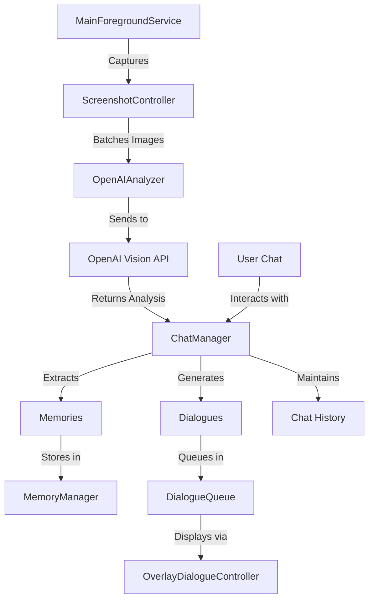

# 🎮 Deltarune Companion - Android AI Screenshot Companion

An Android app that creates an AI companion (Ralsei from Deltarune) that observes your device activity through automated screenshots and provides contextual dialogue responses via system overlays.


## ✨ Features

- **📸 Automated Screenshot Monitoring**: Captures screenshots at configurable intervals using MediaProjection API
- **🤖 AI-Powered Analysis**: Sends screenshots to OpenAI Vision API for intelligent content analysis
- **🧠 Memory System**: Stores user activity memories with timestamps for contextual awareness
- **💬 Interactive Chat**: Direct chat interface with the AI companion
- **🎭 System Overlay Dialogue**: Character dialogue bubbles that appear over other apps
- **⚙️ Configurable Settings**: Customizable screenshot intervals, image quality, batch processing, and AI prompts
- **🌓 Theme Support**: Dark and light mode with Material Design 3
- **📊 Memory Log**: Review all stored memories with timestamps
- **🎨 Ralsei Persona**: Character-driven AI responses matching Deltarune's Ralsei personality

## 🏗️ Architecture

### Core Components

| Component | Responsibility |
|-----------|----------------|
| **MainForegroundService** | Long-running background service managing screenshot automation and lifecycle |
| **ScreenshotController** | Handles MediaProjection API for persistent virtual display and screenshot capture |
| **OpenAIAnalyzer** | Batch processes screenshots via OpenAI Vision API with Ralsei persona prompts |
| **ChatManager** | Manages conversational AI with memory integration and dialogue generation |
| **MemoryManager** | Persistent storage for user activity memories with timestamp tracking |
| **OverlayDialogueController** | System overlay for displaying character dialogue bubbles over other apps |
| **PrefsHelper** | Centralized SharedPreferences wrapper with type-safe getters/setters |
| **EnvLoader** | Reads `openai.env` from assets for API keys (excluded from version control) |
| **NotificationHelper** | Manages foreground service notifications and permission handling |

### Data Flow



**Flow Steps:**
1. Background service captures screenshots at configured intervals
2. Screenshots are batched and sent to OpenAI Vision API with character persona prompts
3. AI responses are parsed for memory storage and dialogue suggestions
4. DialogueQueue manages display of character interactions via system overlays
5. Users can directly chat with the companion through the chat interface
6. Memories persist across sessions and inform future AI responses

## 📋 Prerequisites

- **Android 7.0 (API level 24) or higher**
- **OpenAI API key** for screenshot analysis functionality ([Get one here](https://platform.openai.com/api-keys))
- **Android Studio** (for development) - Hedgehog (2023.1.1) or later recommended
- **Gradle 8.0+** and **Kotlin 1.9+**

## 🚀 Setup

### 1. Clone the Repository

```bash
git clone https://github.com/JaclyNolan/DeltaruneCompanionProject.git
cd DeltaruneCompanionProject
```

### 2. Configure OpenAI API Key

Create `app/src/main/assets/openai.env` file (**⚠️ DO NOT commit this file**):

```env
# Required: Your OpenAI API key
OPENAI_API_KEY=sk-your-actual-api-key-here

# Optional: Custom prompts for AI analysis
OPENAI_PROMPT="Your custom prompt for image analysis"
OPENAI_CHAT_PROMPT="Your custom prompt for chat interactions"
```

> **Note:** See `app/src/main/assets/openai.env.example` for reference template.

### 3. Build and Install

#### Option A: Using Gradle (Command Line)

```bash
# Windows (PowerShell)
.\gradlew assembleDebug
.\gradlew installDebug

# Linux/macOS
./gradlew assembleDebug
./gradlew installDebug
```

#### Option B: Using Android Studio

1. Open the project in Android Studio
2. Sync Gradle files
3. Connect your Android device or start an emulator
4. Click Run ▶️ or press `Shift+F10`

## 🔐 Required Permissions

The app requires several sensitive permissions for full functionality:

| Permission | Purpose | Required |
|------------|---------|----------|
| **FOREGROUND_SERVICE_MEDIA_PROJECTION** | Capturing screenshots in background | ✅ Yes |
| **SYSTEM_ALERT_WINDOW** | Displaying overlay dialogue bubbles | ✅ Yes |
| **POST_NOTIFICATIONS** | Service status notifications | ✅ Yes |
| **WRITE_EXTERNAL_STORAGE** | Saving screenshots locally (optional) | ⚠️ Optional |

### Granting Permissions

1. **Media Projection**: Granted when starting screenshot service (one-time prompt)
2. **System Alert Window**: Settings → Apps → Special access → Display over other apps
3. **Notifications**: Usually granted automatically; check Settings → Apps → Notifications if needed

## ⚙️ Configuration

### 📸 Screenshot Settings
- **Interval**: Time between screenshots (5s - 300s, default: 30s)
- **Image Scale**: Reduce image size for faster processing (0.1-1.0, default: 0.5)
- **Image Quality**: JPEG compression quality (0-100%, default: 80%)
- **Save Screenshots**: Optional local storage of captured images to Pictures folder

### 🤖 AI Analysis Settings
- **Batch Size**: Number of images per OpenAI request (1-10, default: 5)
  - Larger batches = fewer API calls but longer processing time
  - Smaller batches = faster responses but more API calls
- **Custom Prompts**: Override default Ralsei persona prompts in Advanced settings
- **Memory Storage**: Automatic saving of significant user activities
- **Model Selection**: Choose between GPT-4 Vision models (configurable in code)

### 🎨 UI Settings
- **Dark/Light Theme**: Toggle app appearance
- **Auto-advance Dialogues**: Automatic progression of character dialogues (5s delay)
- **Developer Debug Mode**: Show internal AI processing messages and raw responses
- **Dialogue Display**: Configure overlay position and appearance

## 📱 Usage

### Initial Setup
1. Launch the app and grant required permissions
2. Configure your OpenAI API key in **Advanced** settings tab
3. Adjust screenshot interval and image quality in **Settings** tab
4. Tap **Start Service** to begin screenshot monitoring

### 🎭 Interacting with Ralsei
- **Automatic Dialogue**: Ralsei observes your activity and occasionally comments via overlay bubbles
- **Direct Chat**: Use the **Chat** tab to have real-time conversations
- **Memory Review**: Check the **Memory Log** tab to see what Ralsei remembers about you
- **Dialogue History**: View past dialogues in the **Dialogue** tab

### 🚫 Activity Exclusions
The app automatically excludes certain activities from screenshot monitoring:
- MainActivity (settings screen)
- ChatActivity (chat interface)
- MemoryLogActivity (memory log viewer)
- AdvancedActivity (advanced settings)
- Other internal app screens

> You can configure additional exclusions in `MyApplication.kt`

### 💡 Tips
- **Battery Optimization**: Add app to battery optimization exceptions for reliable background operation
- **API Costs**: Monitor your OpenAI API usage; consider increasing screenshot interval to reduce costs
- **Privacy**: Use activity exclusions for apps you don't want monitored (banking, passwords, etc.)
- **Storage**: Enable "Save Screenshots" only if you need local copies (uses device storage)

## 🛠️ Development

### Tech Stack

- **Language**: Kotlin 1.9+
- **UI Framework**: Jetpack Compose with Material Design 3
- **Architecture**: Service-oriented with coroutines
- **Build System**: Gradle 8.0+ with Kotlin DSL
- **Dependency Management**: Version catalog (`gradle/libs.versions.toml`)
- **Minimum SDK**: 24 (Android 7.0)
- **Target SDK**: 34 (Android 14)

### Project Structure

```
app/src/main/java/com/example/myapplication/
├── MyApplication.kt              # Application class with activity lifecycle tracking
├── MainActivity.kt               # Main settings and control interface (Compose)
├── ChatActivity.kt               # Direct chat interface with AI (Compose)
├── MemoryLogActivity.kt          # View stored memories (Compose)
├── AdvancedActivity.kt           # Advanced configuration settings (Compose)
├── MainForegroundService.kt      # Core background service for screenshot automation
├── ScreenshotController.kt       # MediaProjection and screenshot capture logic
├── OpenAIAnalyzer.kt            # Batch processing for OpenAI Vision API
├── ChatManager.kt               # Conversational AI with history persistence
├── MemoryManager.kt             # Persistent memory storage (JSON-based)
├── OverlayDialogueController.kt # System overlay dialogue display
├── PrefsHelper.kt               # Centralized SharedPreferences management
├── EnvLoader.kt                 # Environment configuration loader (.env files)
├── NotificationHelper.kt        # Foreground service notifications
└── ui/                          # Compose UI components
    ├── ScreenshotApp.kt         # Main UI navigation and screens
    ├── ChatScreen.kt            # Chat interface composables
    ├── DialogueUI.kt            # Overlay dialogue components
    └── theme/                   # Material Design 3 theme
        ├── Color.kt
        ├── Theme.kt
        └── Type.kt
```

### Key Development Patterns

#### 1. Configuration Management
```kotlin
// Immediate UI state + persistent storage pattern
var imageScale by remember { mutableStateOf(prefs.getImageScale()) }

onScaleChange = { newScale ->
    imageScale = newScale          // Update UI state
    prefs.setImageScale(newScale)  // Persist to SharedPreferences
}
```

#### 2. Coroutine Usage
```kotlin
// Background services use IO dispatcher with SupervisorJob
private val scope = CoroutineScope(Dispatchers.IO + SupervisorJob())

scope.launch {
    // Background work
    val result = processScreenshots()
    
    // UI updates switch to Main context
    withContext(Dispatchers.Main) {
        updateUI(result)
    }
}
```

#### 3. OpenAI Integration
```kotlin
// Fallback resolution: prefs → env file → default
var apiKey = prefs.getOpenAIApiKey()?.takeIf { it.isNotBlank() }
if (apiKey.isNullOrBlank()) {
    apiKey = EnvLoader.getOpenAIApiKey(context)
}

// Batch processing with configurable size
val batchSize = prefs.getBatchSize() // 1-10 images
val batches = screenshots.chunked(batchSize)
```

#### 4. Atomic Operations
```kotlin
// Prevent concurrent processing
private val isProcessing = AtomicBoolean(false)

fun processScreenshots() {
    if (!isProcessing.compareAndSet(false, true)) {
        return // Already processing
    }
    try {
        // Process screenshots
    } finally {
        isProcessing.set(false)
    }
}
```

### Dependencies

Key libraries used (see `gradle/libs.versions.toml` for versions):
- **Jetpack Compose BOM**: UI framework
- **Kotlin Coroutines**: Async/await patterns
- **OkHttp**: HTTP client for OpenAI API
- **Gson**: JSON parsing
- **Coil**: Image loading in Compose
- **Material3**: UI components

### Testing

```bash
# Windows PowerShell
.\gradlew testDebugUnitTest              # Run unit tests
.\gradlew connectedDebugAndroidTest      # Run instrumented tests
.\gradlew test                           # Run all tests

# Linux/macOS
./gradlew testDebugUnitTest
./gradlew connectedDebugAndroidTest
./gradlew test
```

### Debugging

#### Service Logs
```bash
# Monitor all service logs
adb logcat -s MainForegroundService ScreenshotController OpenAIAnalyzer ChatManager

# Monitor specific component
adb logcat -s ScreenshotController

# Clear logs and monitor
adb logcat -c && adb logcat -s MainForegroundService
```

#### Common Issues

| Issue | Solution |
|-------|----------|
| **MediaProjection permission denied** | Settings → Apps → Special access → Display over other apps → Enable for app |
| **OpenAI API errors** | Verify API key in `openai.env` file and check logs for error messages |
| **Overlay not showing** | Ensure System Alert Window permission is granted |
| **Screenshots not capturing** | Check if MediaProjection permission was granted and service is running |
| **High battery usage** | Increase screenshot interval or reduce batch frequency |
| **Memory issues** | Clear old memories in Memory Log or reduce batch size |

#### Development Tools
```bash
# Install debug build
.\gradlew installDebug

# Uninstall app
adb uninstall com.example.myapplication

# View app data
adb shell run-as com.example.myapplication ls -la /data/data/com.example.myapplication/files

# Clear app data
adb shell pm clear com.example.myapplication
```

## 🔒 Privacy & Security

- ✅ Screenshots are processed locally and sent **only** to OpenAI for analysis
- ✅ No data is stored on external servers beyond OpenAI's processing
- ✅ API keys are stored locally in app private storage and never transmitted except to OpenAI
- ✅ Memory data is stored locally in JSON format in app private storage
- ✅ Users can exclude specific activities from monitoring via code configuration
- ✅ Screenshots can be optionally saved locally or discarded after processing
- ⚠️ **Important**: Be mindful of sensitive information (passwords, banking) - use activity exclusions
- ⚠️ Review OpenAI's [Privacy Policy](https://openai.com/privacy/) and [API Data Usage Policy](https://openai.com/policies/api-data-usage-policies)

### Data Storage Locations

| Data Type | Location | Persistence |
|-----------|----------|-------------|
| **API Keys** | SharedPreferences + `openai.env` | Persistent |
| **Memories** | `/data/data/com.example.myapplication/files/memories.json` | Persistent |
| **Chat History** | `/data/data/com.example.myapplication/files/chat_history.json` | Persistent |
| **Screenshots** | Optional: `/storage/emulated/0/Pictures/Screenshots/` | User-configurable |
| **Settings** | SharedPreferences | Persistent |

## 📄 License

This project is open source under the MIT License. See `LICENSE` file for details.

**Important Notes:**
- This is a fan project inspired by Deltarune. All Deltarune characters and IP belong to Toby Fox.
- Ensure you comply with [OpenAI's Terms of Service](https://openai.com/policies/terms-of-use) and [Usage Policies](https://openai.com/policies/usage-policies) when using their API.
- This app is for personal use. Commercial use may require additional permissions and licensing.

## 🤝 Contributing

Contributions are welcome! Please follow these guidelines:

1. **Fork the repository**
2. **Create a feature branch**: `git checkout -b feature/amazing-feature`
3. **Commit your changes**: `git commit -m 'Add amazing feature'`
4. **Push to the branch**: `git push origin feature/amazing-feature`
5. **Open a Pull Request**

### Development Guidelines

- Follow [Kotlin coding conventions](https://kotlinlang.org/docs/coding-conventions.html)
- Use Jetpack Compose best practices
- Add comments for complex logic
- Test thoroughly on physical Android devices
- Update documentation for new features
- Keep API keys out of version control

### Code Style

- Use meaningful variable and function names
- Prefer Kotlin idioms (data classes, extension functions, etc.)
- Use coroutines for async operations
- Follow Material Design 3 guidelines for UI

## 🙏 Acknowledgments

- **Character Design**: Ralsei from [Deltarune](https://deltarune.com/) by [Toby Fox](https://twitter.com/tobyfox)
- **Built With**:
  - [Jetpack Compose](https://developer.android.com/jetpack/compose) - Modern Android UI toolkit
  - [Kotlin Coroutines](https://kotlinlang.org/docs/coroutines-overview.html) - Async programming
  - [OpenAI Vision API](https://platform.openai.com/docs/guides/vision) - AI image analysis
  - [OkHttp](https://square.github.io/okhttp/) - HTTP client
  - [Material Design 3](https://m3.material.io/) - UI components
  - [Coil](https://coil-kt.github.io/coil/) - Image loading

## 📞 Support

- **Issues**: [GitHub Issues](https://github.com/JaclyNolan/DeltaruneCompanionProject/issues)
- **Discussions**: [GitHub Discussions](https://github.com/JaclyNolan/DeltaruneCompanionProject/discussions)
- **Documentation**: See `.github/copilot-instructions.md` for detailed architecture notes

## 🗺️ Roadmap

Future improvements and features:

- [ ] Support for other AI models (Claude, Gemini)
- [ ] Customizable character personas
- [ ] Voice synthesis for dialogues
- [ ] Improved memory search and filtering
- [ ] Export/import memory and chat history
- [ ] Widget for quick dialogue access
- [ ] Enhanced privacy controls and content filtering
- [ ] Multi-language support
- [ ] Wear OS companion app

---

**Made with ❤️ by the Deltarune Companion team**

*This is a fan project and is not affiliated with or endorsed by Toby Fox or the official Deltarune team.*